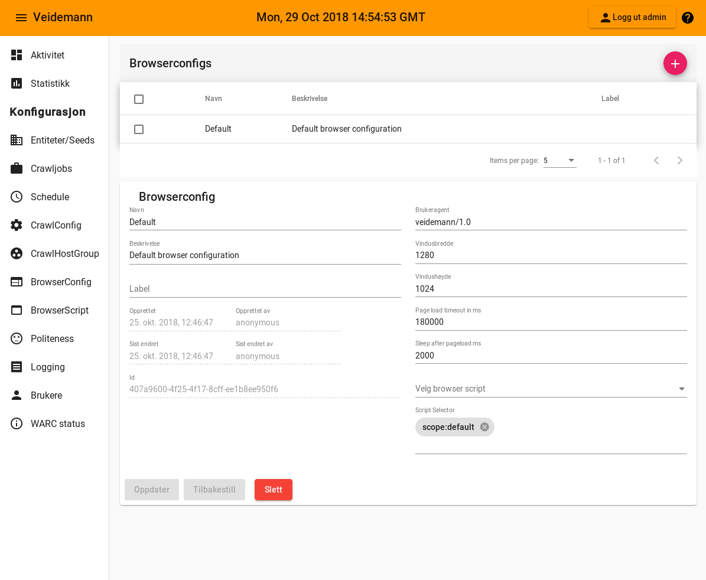

{}
Browserconfig blir brukt av [crawlconfig](../crawlconfig)
{}  

 Felt                                                          | Funksjon
---------------------------------------------------------------|-----------------------------------------------------------------------------
[Brukeragent](#browserconfig-useragent)                        | Setter user agent
[Vindusbredde](#browserconfig-window-width)                    | Bredden på nettleservinduet benyttet av høsteren
[Vindushøyde](#browserconfig-window-height)                    | Høyeden på nettleservinduet benyttet av høsteren
[Pageload timeout in ms](#browserconfig-pageload-timeout)      | Hvor mange millisekund høsteren skal vente på svar fra siden før den gir opp
[Sleep after pageload ms](#browserconfig-sleep-after-pageload) | hva gjør dette feltet?
[Browser script](#browserconfig-browserscript)                 | Hvilke script skal nettleseren kjøre under høsting.
[Script selector](#browserconfig-scriptselector)               | Bruk gjeldende script som har label som tilsvarer selector  

#### Brukeragent {#browserconfig-useragent}
-------------------------------------------

#### Vindsubredde {#browserconfig-window-width}
-----------------------------------------------

#### Vindushøyde {#browserconfig-window-height}
-----------------------------------------------

#### Pageload timeout {#browserconfig-pageload-timeout}
-------------------------------------------------------

#### Sleep after pageload {#browserconfig-sleep-after-pageload}
-----------------------------------------------------------------

#### Browserscript {#browserconfig-browserscript}
--------------------------------------------------

#### Script selector {#browserconfig-scriptselector}
----------------------------------------------------