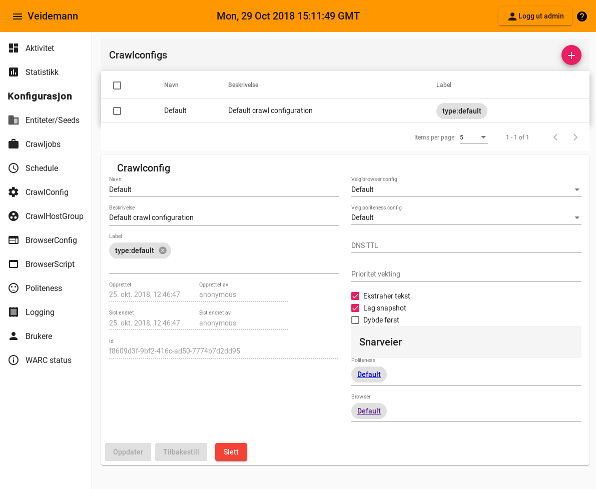

{}
Crawlconfig blir brukt av [crawljob](../crawljob)
{}  

Felt                                             | Betydning
-------------------------------------------------|------------------------------------------
[Browserconfig](#crawlconfig-browserconfig)      | Hvilken [browserconfig](../browserconfig) skal benyttes
[Politenessconfig](#crawlconfig-politenessconfig)| Hvilken [politenessconfig](../politenessconfig) skal benyttes
[DNS TTL](#crawlconfig-dns-ttl)                  | Hvor lenge skal DNS oppslag lagres
[Prioritet vekting](#crawlconfig-priority-weight)| Sette prioritet 
[Ekstraher tekst](crawlconfig-extract-text)      | Skal teksten på en høstet side legges i databasen
[Lag snapshot](#crawlconfig-create-snapshot)     | Skal det lages snapshot av forsiden til siden 
[Dybde først](#crawlconfig-depth-first)          | Skal det høstes ...

#### Browserconfig {#crawlconfig-browserconfig}
-----------------------------------------------  

[browserconfig](../browserconfig)

#### Politenessconfig {#crawlconfig-politenessconfig}
-----------------------------------------------------
  
[politenessconfig](../politenessconfig)

#### DNS TTL {#crawlconfig-dns-ttl}
------------------------------------

#### Prioritet vekting {#crawlconfig-priority-weight}
-----------------------------------------------------

#### Ekstraher tekst {crawlconfig-extract-text}
-----------------------------------------------

#### Lag snapshot {#crawlconfig-create-snapshot}
------------------------------------------------

#### Dybde først {#crawlconfig-depth-first}
-------------------------------------------