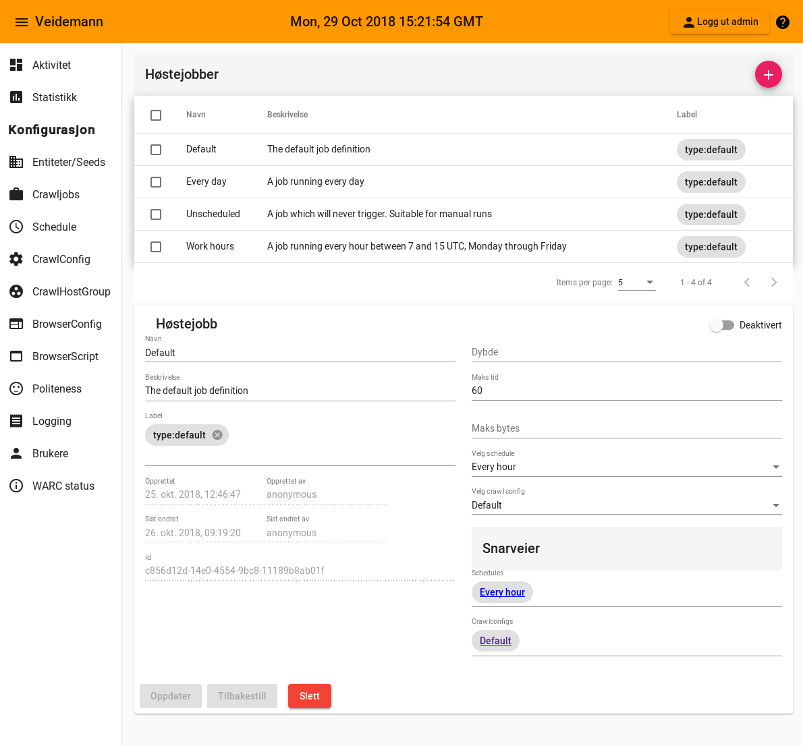

  

Felt                                | Betydning
------------------------------------|------------------------------------------
[Dybde](#crawljob-depth)            | Hvor mange nivå ned skal høsteren gå
[Maks tid](#crawljob-max-time)      | Hvor lenge skal jobben få lov til å kjøre
[Maks bytes](#crawljob-max-bytes)   | Hvor store filer skal få lov til å bli lastet ned
[Schedule](#crawljob-schedule)      | Hvilken [schedule](../schedule) skal benyttes
[Crawlconfig](#crawljob-crawlconfig)| Hvilken [crawlconfig](../crawlconfig) skal benyttes  

#### Dybde {#crawljob-depth}
----------------------------  

#### Maks tid {#crawljob-max-time}
----------------------------------  

#### Maks bytes {#crawljob-max-bytes}
-------------------------------------  

#### Schedule {#crawljob-schedule}
----------------------------------  

[schedule](../schedule)  

#### Crawlconfig {#crawljob-crawlconfig}
----------------------------------------  

[crawlconfig](../crawlconfig)