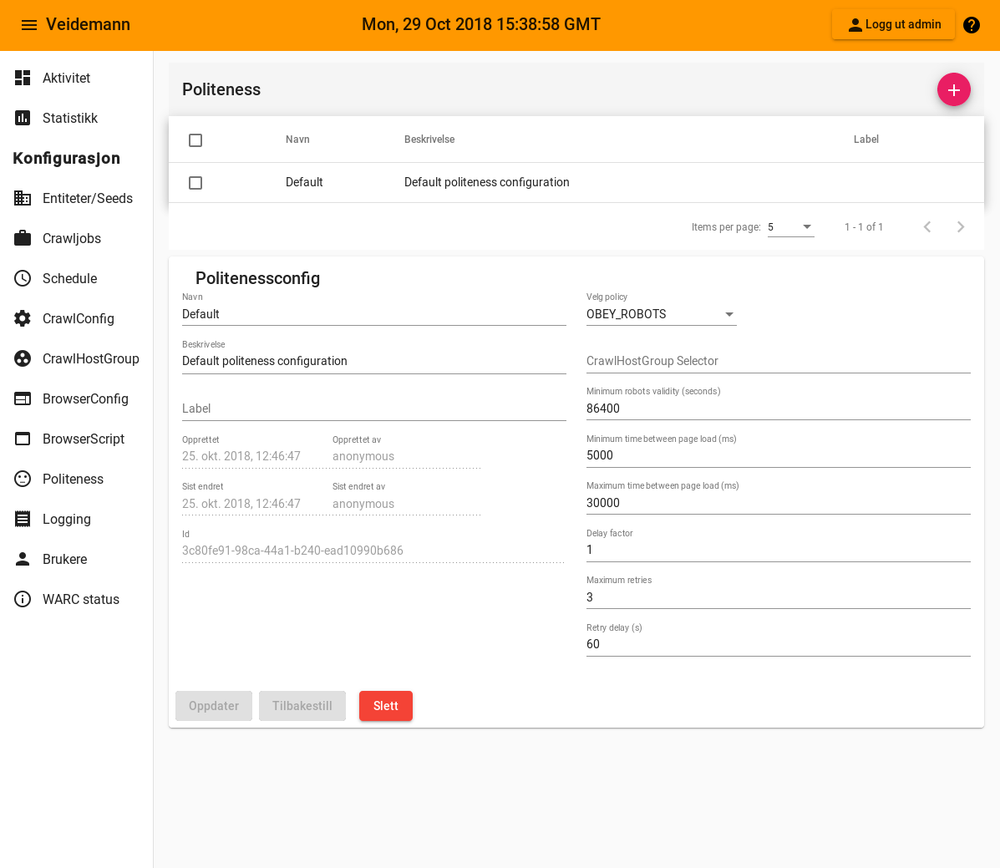

{}
Benyttes av [crawlconfig](../crawlconfig)
{}  

  

Felt                                                                | Betydning
--------------------------------------------------------------------|-----------------------------------------
[Policy](#config-policy)                                            | Hvilken policy skal benyttes
[Crawlhostgroup selector](#config-crawlhostgroup-selector)          | Hvilke .....
[Minimum robots validity](#config-min-robots-validity)              | Hvor mange sekund skal robot minst
[Maximum robots validity](#config-max-robots-validity)              | Hvor mange sekund skal robot maks
[Maximum time between page load](#config-max-time-between-pageload) | Hvor mange millisekund skal det maks ta  mellom sideinnlastninger
[Delay factor](#config-delay-factor)                                | Hvor ....
[Maximum retries](#config-max-retries)                              | Maks antall forsøk
[Retry delay](#config-retry-delay)                                  | Hvor mange sekund skal man vente før siden lastes på nytt

#### Policy {#config-policy}
----------------------------  

#### Crawlhostgroup selector {#config-crawlhostgroup-selector}
--------------------------------------------------------------

#### Minimum robots validity {#config-min-robots-validity}
----------------------------------------------------------

#### Maximum robots validity {#config-max-robots-validity}
----------------------------------------------------------

#### Maximum time between page load {#config-max-time-between-pageload}
-----------------------------------------------------------------------

#### Delay factor {#config-delay-factor}
----------------------------------------

#### Maximum retries {#config-max-retries}
------------------------------------------

#### Retry delay {#config-retry-delay}
--------------------------------------

